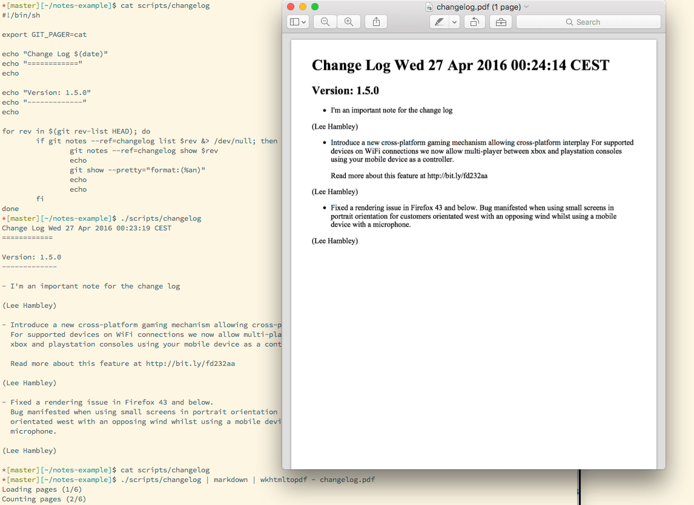

# Effortlessly maintain a high quality change log with Git notes
> Posted on April 27, 2016 by Lee Hambley

A properly maintained change log is the cornerstone of any mature and well-maintained project. Of course one could make the argument that the git log itself is the
ultimate change log, but it rather represents the how, not the why or what, which non-technical teammates probably care about.

The proposal laid forth in this post will allow you to effortlessly maintain a change log for your project which is suitable for stake holders, product owners, clients
and customers, without breaking your back and adding more workflow steps.

## Git Notes

git notes has been a feature of Git since 1.7.x circa 2012, it’s not incredibly widely used although it is pretty well documented and elegant.1
Git notes allows you to add a note to a commit. Specifically, and very restrictively it only allows one note per commit (with some important exceptions that we’ll come to soon!).

Before diving into how we might use this to maintain a change log, let’s take a look at how Git notes works in general, let’s assume we play through the following:

```
[~]$ mkdir notes-example
[~]$ cd notes-example
[~/notes-example]$ git init .
Initialized empty Git repository in ./notes-example/.git/ [~/notes-example]$ printf "hello world\n" > foo.txt *[master][~/notes-example]$ git add foo.txt *[master][~/notes-example]$ git commit -am "Hello World" [master (root-commit) 80a3b04] Hello World
1 file changed, 1 insertion(+) create mode 100644 foo.txt
```

Nothing groundbreaking here, we’ve setup an empty Git repository and introduced a simple file which contains a universal greeting, if we look at the commit referenced by HEAD we’ll see the following

```
commit 80a3b04b76ec1f33f145a86e88db236c79c471d7 Author: Lee Hambley <leehambley@harrow.io> Date: Tue Apr 26 22:18:17 2016 +0200
Hello World
diff --git a/foo.txt b/foo.txt new file mode 100644
index 0000000..3b18e51
--- /dev/null
+++ b/foo.txt @@ -0,0 +1 @@ +hello world
```

Interestingly, and importantly for a complete understanding of what’s going on in this guide, it’s vital to understand that Git uses cryptographically secure storage, this means if you repeat the commands pasted here verbatim, you will have the same commit hash.

This means that if we wanted to change the commit message, we couldn’t without changing the hash of this commit, which means it’s not the same commit anymore; if you had already pushed this to a remote and then wanted to change the commit message you’d have to push with --force which can be really dangerous if anyone or anything else already pulled those commits.

So, with that cleared up – from the first line of the git notes documentation:

> git notes: Adds, removes, or reads notes attached to objects, without touching the objects themselves.

Let’s make some noise in our Git history, some stuff we wouldn’t like to be shown to anyone outside the development team, we’ll use `git commit --allow-empty - m "...."` to simulate some work so we have a git ref log with more than one item:

```
[master][~/notes-example]$ git log --pretty=oneline
868db1 Fix typo
fd1c86 Revert 'Upgrade version X of Y'
6960f6 Implement Bob's pet-project feature, he loves this feature more than his own mother! f98013 Disable 'use strict' to try and fix the build
23829e Fix stupid Firefox bug b2afd5 Upgrade version X of Y 80a3b0 Hello World
```

Here we have a realistic project history, and if we wanted to generate a change log from this that was confined to what was useful outside the team we might think about the two relevant commits above which have a user-facing value and work from there.

Note: If your team happens to use something like git flow that shouldn’t stop you generating a change log with the technique in this post, but you might have a master branch that looks a little bit cleaner than the extremely contrived example here!

We might consider whether it’s worth tagging or annotating our commit messages, I’ve seen companies who use #hashtags for issues to which the feature relates `#JIRA-BILL-1337` which some tooling used to generate a HTML report from the list, but let’s pretend that developers don’t want to annotate their Git commits with such junk metadata because we want to write good commit messages.

## Using Git Notes To Maintain The Change Log

With the state set, we know we’re interested in including `23829e` (“Fix stupid Fire...”) and `6960f6` (“Implement Bob’s pet-project feature, he lo...”) in the human readable change log, possibly we care about maintaining separate “Features” and “Fixes” change logs, but more on that below.

This note applies to the current `HEAD` (“Fix typo”), so if we do git show `[head]` we’ll see:

```
commit 868db1289ffe22bb15594c6148a2166f460e01d4
Author: Date:
Lee Hambley <leehambley@harrow.io> Tue Apr 26 22:32:44 2016 +0200

    Fix typo”

Notes:
    Quick Note Test
```

Importantly you can see that `HEAD` is still pointing at ref `868db1`, this means although the message appears differently, it has not changed. If the commit message had
changed it would not still have the SHA1 hash of `868db1`.

## So where did that note get saved?

If we look into `./.git/refs/notes` we can see something interesting:

```
[master][~/notes-example]$ cat .git/refs/notes/commits 76d8cc3f68f340dd7cd1b378708deaaa7876369b [master][~/notes-example]$ git show $(cat .git/refs/notes/commits) commit 76d8cc3f68f340dd7cd1b378708deaaa7876369b
Author: Lee Hambley <leehambley@harrow.io> Date: Tue Apr 26 22:49:00 2016 +0200
Notes added by 'git notes add'
diff --git a/868db1289ffe22bb15594c6148a2166f460e01d4 b/868db1289ffe22bb15594c6148a2166f460e01d4 new file mode 100644
index 0000000..21854ff
--- /dev/null
+++ b/868db1289ffe22bb15594c6148a2166f460e01d4 @@ -0,0 +1 @@
+Quick Note Test
```

If this looks a little alien don’t worry too much, essentially Git has made a new commit, and the note we created is a file somewhere in Git’s object database, and it is simply tied to the commit we annotated with some internal Git glue. If you’re interested to know more you can learn more about the Git internals here. It’s not important to understand everything about how it works to use it though.

Now that we know how git notes works, we still have a question open, how does that tie-in with the git show command which is now displaying our note? The simple fact is that git show has a special case that includes notes in the default namespace (`.git/refs/notes/*`), with that final piece of the puzzle that leads us nicely into the next section.

## Namespaced Git Notes

First of all, typing git notes append ... might get frustrating, we can alias that locally or globally with Git and save ourselves some typing by setting up the following Git or shell alias, I’m demonstrating the Git format as I prefer to have project-local aliases:

```
git config alias.changelog "notes --ref=changelog append"
```

We alias notes ... append here, rather than notes ... add because notes ... add will throw an error if the note already exists, and if we run $ git changelog we probably don’t mind if we’re adding new, or editing existing change log notes.

Before going further it’s worth mentioning that we’re getting off the beaten-path of Git, we’re no longer going to see notes in our `--ref=changelog` namespace by default in git show because Git doesn’t know how to render these natively, we can easily fix that, let’s make a change log note and see how things look, HEAD is still implied:

```
[master][~/notes-example]$ git changelog -m "- I'm an important note for the change log"
[master][~/notes-example]$ git show
commit 868db1289ffe22bb15594c6148a2166f460e01d4
Author: Lee Hambley <leehambley@harrow.io>
Date: Tue Apr 26 22:32:44 2016 +0200

    Fix typo

Notes:

    Quick Note Test
```

Great, so the secret is that git show without a `--notes` argument implies `--notes=commits`, that explains the results when we were poking around in `.git/refs` earlier.

By now the pieces must be falling in to place:

- The notes are their own file, managed by Git
- They have multiple namespaces, so we can keep notes for the change log separate from other notes
- There can’t be more than one note per commit (per namespace, but we can easily edit it.
- Having a Git alias to manage the change log means we don’t have to care whether change log notes for this commit exist or not.

## Sharing (Custom) Notes

It’s really important to remember that Git doesn’t push notes by default, not even it’s own special commits internal default namespace notes! This is a horrible user experience. Unfortunately as so few people use Git notes there isn’t much incentive to fix it, but it’s easy to make the user experience a LOT better!

So let’s put things in perspective, Git doesn’t even push tags by default, it has a special `git push --tags` option which pushes tags, and we’ve already seen that notes are outside our linear project history, so if we needed some separate command to push/pull change log notes, it wouldn’t be too bad.

We know that our notes reside in `./.git/refs/notes`, and that Git tags reside in `./.git/refs/tags`, since we also know from the documentation that git push -tags basically expands to `git push origin refs/tags/*` we might guess that the following would push our change log notes:

```
[master][~/notes-example]$ git push origin refs/notes/*
Counting objects: 6, done.
Delta compression using up to 4 threads.
Compressing objects: 100% (4/4), done.
Writing objects: 100% (6/6), 546 bytes | 0 bytes/s, done.
Total 6 (delta 0), reused 0 (delta 0)
To git@bitbucket.org:leehambley/notes-example.git
 * [new branch]      refs/notes/changelog -> refs/notes/changelog
 * [new branch]      refs/notes/commits -> refs/notes/commits
 ```

Looks good! The `[new branch]` message is a little bit misleading, but don’t worry about it! These change log notes don’t show up as branches (or at all, even) in any Git web interface or GUI which I tested.

We can make this automatic by setting the following two Git configs which specify that Git should push and fetch refs matching `refs/notes/changelog` by default:

```
[master][~/notes-example]$ git config --add remote.origin.push '+refs/notes/changelog:refs/notes/changelog`
[master][~/notes-example]$ git config --add remote.origin.fetch '+refs/notes/changelog:refs/notes/changelog`
```

A quick verbose Git push confirms that git push without explicitly naming ... origin refs/notes/* that were pushing change log notes by default now:

```
[master][~/notes-example]$ git push -v
Pushing to git@bitbucket.org:leehambley/notes-example.git
To git@bitbucket.org:leehambley/notes-example.git
 = [up to date]      refs/notes/changelog -> refs/notes/changelog
Everything up-to-date
```

## Generating Our Change Log

So far we’ve learned what a `git note` is, now to separate a specific type of note (change log entries) from generic notes, how to filter them and show them, and how to make sure they are shared with our team without having to do any extra work. We also (and importantly) verified that it’s safe to push and pull notes without rewriting history, incase we decided after pushing code that we should have added a change log note.

Let’s remove our test notes and add the legitimate change log release notes we wanted to add, and then _finally_ generate our change log:

```
[master][~/notes-example]$ git notes remove [HEAD]
[master][~/notes-example]$ git notes --ref=changelog remove [HEAD]
```

These two commands remove all notes from `HEAD`, let’s then add our notes to the other two commits, and run a git log `--pretty:...` line to print our change log, `%h`, `%N` and `%an` expand to “Short Hash”, “Notes” and “Author Name” fields respectively:

```
[master][~/notes-example]$ git log --pretty="format:(%h) %N %an" --show-notes=*
(868db12) - I'm an important note for the change log
 Lee Hambley
(fd1c860)  Lee Hambley
(6960f67) - Introduce a new cross-platform gaming mechanism allowing cross-platform interplay
  For supported devices on WiFi connections we now allow multi-player between
  xbox and playstation consoles using your mobile device as a controller.

  Read more about this feature at http://bit.ly/fd232aa
 Lee Hambley
(f98013d)  Lee Hambley
(23829e1) - Fixed a rendering issue in Firefox 43 and below.
  Bug manifested when using small screens in portrait orientation for customers
  orientated west with an opposing wind whilst using a mobile device with a
  microphone.
 Lee Hambley
(b2afd58) Lee Hambley
(80a3b04) Lee Hambley%
```

Yikes, almost there, maybe we can clean this up a bit using git `rev-list` and a loop:

```
[master][~/notes-example]$ cat ./script/changelog
#!/bin/sh
for rev in $(git rev-list HEAD); do
  if git notes --ref=changelog list $rev &> /dev/null; then
    git notes --ref=changelog show $rev
  fi
done
```

Git’s `rev-list` subcommand lets us walk through the commit history in the same order that we would if this were git log or similar, it gives us back one line each of the parent commits of `HEAD`, which is a roundabout way of saying that it gives us the entire history of the repository. It can also take a `from..to` commit ref pair for generating intermediate change logs between release tags, keep reading for some more tips about that!

Quite simply then, here is our finished change log:

```
[master][~/notes-example]$ ./script/changelog
- I'm an important note for the change log
- Introduce a new cross-platform gaming mechanism allowing cross-platform interplay
  For supported devices on WiFi connections we now allow multi-player between
  xbox and playstation consoles using your mobile device as a controller.

  Read more about this feature at http://bit.ly/fd232aa
- Fixed a rendering issue in Firefox 43 and below.
  Bug manifested when using small screens in portrait orientation for customers
  orientated west with an opposing wind whilst using a mobile device with a
  microphone.
```

We could easily add lots of metadata from the $rev variable, it’s tags, branches, etc, we could even add authorship information to the individual lines using `git show --pretty=... $rev` to grab the commit specific details. We can even trivially run the change log through a markdown processor to generate HTML from which we can generate a PDF, for example:



## Wrapping Up & Taking The Concept Further

Some projects might want to split their change log into sections such as “Bug Fixes”, “Features” and “Changes”, if your project does this there’s no reason you couldn’t setup the following aliases:

```
git config alias.cl-bug "notes --ref=changelogs/bugs append"
git config alias.cl-feature "notes --ref=changelogs/features append"
```

Then throughout your ref log you could easily call `$ git cl-bug` or `$ git cl-feature` and have those written to different subsets of notes. The resulting change log could be generated from both:

```
[master][~/notes-example]$ GIT_NOTES_REF=refs/notes/changelogs/* git log --pretty=format:%N | markdown
<ul>
<li>**BUG** Lorem ipsum dolor sit amet, consectetur adipiscing elit.</li>
<li>**FEATURE** In faucibus arcu a felis sagittis posuere nec vel purus</li>
</ul>
```

If you do pursue this route, you’d probably be building a couple of tools around this, for example restricting the log generated to `tags/releases/v1.0.0..tags/releases/v1.1.0`, and you’d almost certainly want to experiment with looping over each commit individually to generate a pretty log.

If you go down this road, remember to setup appropriate `push=...` lines in your `.git/config` file, and to document that somewhere prominently for anyone else in your team who needs to use this tooling!

## Summary

We’d love to see some standards and tooling grow up around these practices, Git provides the framework for a hugely powerful graph of data about a project’s history, lifecycle and development, and it doesn’t have to be restricted to people who live in the command line!

There are some caveats, such as a potential for dangling notes when rebasing commits (the commit SHA1 changes, and the note becomes disassociated, but it’s also easily remedied), but they are rather edge-cases and mostly because the `git notes` tool hasn’t seen as much use as some other more mature parts of Git.
